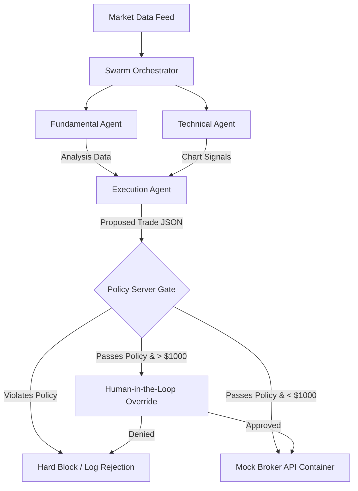

This is the foundation of your repository. By packaging our architectural discussions, the `policy_config.yaml`, the workflow roadmap, and the system architecture diagram into a single, clean markdown file, you create a perfect **System Initialization Spec**.

Save this text as `SPEC_AND_ROADMAP.md` in the root of your project directory. It establishes the rigid, deterministic constraints needed for a production-ready Zero-Trust architecture before writing a single line of code.

---

# SPEC_AND_ROADMAP.md: Zero-Trust Trading Desk

## 1. System Vision & Objective

The **Trading Agent Harness** is a production-grade multi-agent framework built for high-stakes financial environments. Autonomous agents typically operate with "Ambient Authority," meaning they possess implicit trust to execute actions. This framework forces a **Zero-Trust paradigm**: agents are treated as untrusted, isolated entities. Every single transaction proposal is intercepted, parsed, and validated by a separate, deterministic **Policy Server** before hitting execution endpoints.

---

## 2. Multi-Agent System Architecture

The framework separates intellectual deliberation from execution privileges using specialized, constrained actors.



### Agent Role & Guardrail Matrix

| Agent Role | Primary Core Objective | Data Input / Scope | Safety Constraint |
| --- | --- | --- | --- |
| **Swarm Orchestrator** | Manages multi-agent context flow. | User parameters & data hooks | Cannot query brokers or generate trades. |
| **Fundamental Agent** | Evaluates long-term intrinsic value. | Financial statements & news | Absolute isolation from trading tools. |
| **Technical Agent** | Tracks short-term price momentum. | Historical candlesticks (RSI/MA) | Absolute isolation from trading tools. |
| **Execution Agent** | Formats structural trade proposals. | Consolidated analytics context | Can only output structured JSON to the Gate. |

---

## 3. System Contract: Deterministic Policy Spec

Every transaction request sent by the execution agent must align with this deterministic configuration file. If a rule is violated, the core Python runtime immediately raises a validation exception, bypassing LLM logic entirely.

### `policy_config.yaml`

```yaml
# ==============================================================================
# TRADING AGENT HARNESS - ZERO-TRUST POLICY CONFIGURATION
# ==============================================================================
version: "1.0.0"
environment: "sandbox" # Forces Mock Broker usage; protects production API keys

global_risk_mandate:
  max_portfolio_exposure_usd: 10000.00
  max_single_trade_value_usd: 2500.00
  max_daily_drawdown_percent: 2.5
  halt_trading_on_drawdown: true

asset_universe:
  allowed_tickers:
    - "AAPL"
    - "MSFT"
    - "SPY"
    - "QQQ"
  restricted_asset_classes:
    - "CRYPTO"
    - "PENNY_STOCKS"
    - "OPTIONS"

agent_permissions:
  fundamental_agent:
    role: "analysis"
    execution_auth: false
    allowed_tools: ["fetch_financial_statements", "fetch_news_sentiment"]
  technical_agent:
    role: "analysis"
    execution_auth: false
    allowed_tools: ["fetch_historical_prices", "calculate_moving_averages"]
  execution_agent:
    role: "orchestration_and_proposal"
    execution_auth: true
    allowed_tools: ["format_trade_proposal_json"]

human_in_the_loop_triggers:
  require_hitl_if_trade_value_exceeds: 1000.00
  require_hitl_if_sentiment_conflict: true
  require_hitl_on_first_trade_of_day: true

context_hygiene:
  mask_account_balance: true
  mask_api_keys: true

```

---

## 4. Implementation Phase Roadmap

### Phase 1: Architectural Scaffolding (Days 1–3)

* [ ] Write the Pydantic data layer matching `policy_config.yaml`.
* [ ] Build the deterministic validation logic inside a core `PolicyServer` class.
* [ ] Construct the `MarketDataAdapter` using `yfinance` alongside local mock fallback data.
* [ ] Configure `docker-compose.yaml` to wire up the isolated agent network and a dummy mock exchange API.

### Phase 2: Agent Swarm & Deliberation (Days 4–7)

* [ ] Draft targeted system prompts enforcing character roles (Fundamental, Technical, Execution).
* [ ] Establish the state-sharing middleware that strips core account figures and PII before LLM compilation.
* [ ] Implement the message passing protocol ensuring the Execution Agent outputs an auditable structural JSON payload.

### Phase 3: Defensive Engineering & HITL Gates (Days 8–11)

* [ ] Build the human override terminal intercepting proposals over $1,000.
* [ ] Design the "Vibe Diff" script—a lightweight utility forcing the agent to print out its underlying trading thesis in a human-readable string.
* [ ] Conduct intentional red-team injection tests attempting to force an unapproved ticker past the Policy Engine.

### Phase 4: Packaging & Submission Prep (Days 12–14)

* [ ] Compile local execution tests into a structured Jupyter Notebook for the Kaggle submission.
* [ ] Verify that a single `docker-compose up --build` cleanly runs the entire workflow locally.
* [ ] Record the 3-minute video showing a valid trade passing through human checklines alongside an unauthorized trade getting hard-blocked by the harness.

---